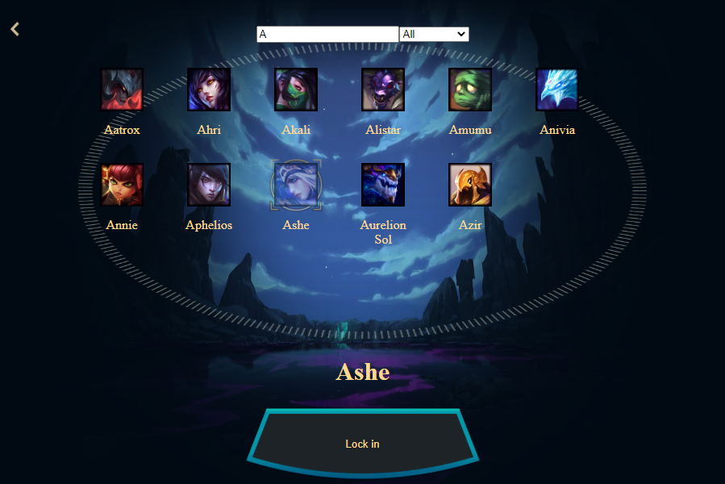
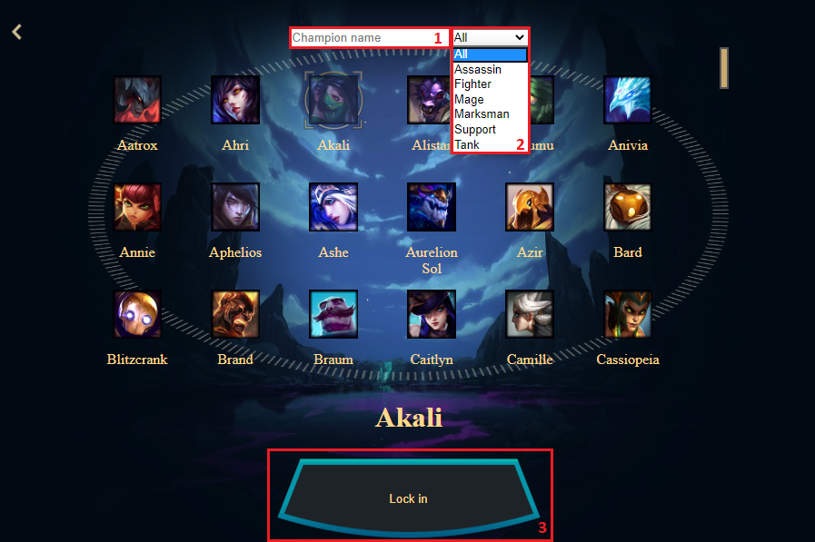

# LoL Champion Database

LoL Champion Database is a simple SPA that gathers data from League of Legends API and displays it to the user.

## Screenshot



## Live version

[Live version](https://lol-champion-db.herokuapp.com/)

## Getting Started

Clone the repository into your local computer.

```
$ git clone https://github.com/kazumaki/lol-champion-db.git
```

### Installing

First, you'll have to install the newest version of [Node](https://nodejs.org/en/download/). Otherwise, the npx command might not be available. Then move into the project main directory on the console and follow the instructions below. 

Install all packages:

```
$ npm install
```

Run local webserver

```
$ npm start
```

Now in your browser type the following address and press enter.

```
http://127.0.0.1:5000
```

### Using the App

Using the App is really simple. It can show you a list of all League of Legends champions, just click on Champions button.

#### Champions list features
* Name Filter - 1
* Tag Filter - 2
* Champion select to see more details - 3

 

## App Development

### Done

The goal when I started working on LoL Champion Database was to fetch the data from all League of Legends champions and display it in a cool way for the user in only 3 days, and I did. But for lack of time, I couldn't implement everything I wanted to. On the first day, I planned to show every Champion skills data like icons and descriptions inside the ChampionDetails page, but I ended showing only some basics stats of each Champion. On the first day, I focused to develop the API calls to get data from League of Legends public API and store it inside Redux store, did it in time, the second day I've focused on the style of the App and how I would display the data fetched, so I've implemented a bunch of components and containers to display all gathered data. The last day I've focused on testing the App and give the last touches to its style.

### Ideas for improvement

* Add more specific data for every champion
* Get more assets for a better styling
* Show live statistics data of champions

## Built With

* [JavaScript](https://www.javascript.com/) - Programming language used
* [React](https://reactjs.org/) - Library used for build UI
* [Redux](https://redux.js.org/) - Library used to share state between React components
* [HTML](https://en.wikipedia.org/wiki/HTML) - Hypertext Markup Language
* [VS Code](https://code.visualstudio.com/) - The code editor used
* [Obisidian](https://github.com/Crauzer/Obsidian/) - Tool to extract image assets from League of Legends client

## Assets

* [All assets](https://www.riotgames.com/en) - All the assets used in the app

## Author

👤 **Vinicius Campos Carvalho**

<a href="https://github.com/kazumaki" rel="noopener noreferrer" target="_blank">

   

</a>

- Github: [@kazumaki](https://github.com/kazumaki)
- Twitter: [@iKazumaki](https://twitter.com/iKazumaki)
- Linkedin: [Vinicius Campos Carvalho](https://www.linkedin.com/in/vcamposcarvalho/)
- Email: [vcampos.pitangui@gmail.com](vcampos.pitangui@gmail.com)

## Presentation

[Video](https://youtu.be/GQPdP4tomHs)

## License

This project is licensed under the MIT License - see the [LICENSE](LICENSE) file for details

## Acknowledgments

* [Project Requirements page](https://www.notion.so/Catalogue-of-Dog-Clothes-8bf1512b8ab34fa28848beb8ab698a32)
